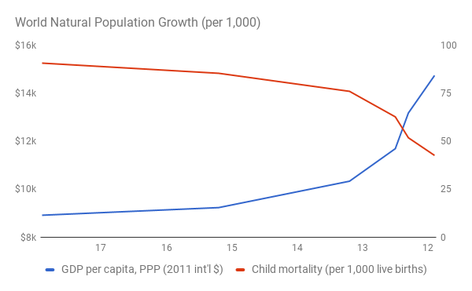

# Population

In 1798, Thomas Malthus predicted widespread famine, as population growth outstripped humanity’s ability to grow food [27]. His prediction was half-right: Global population did explode at the start of the nineteenth century.
 
Since then, the human population has grown from about 1 billion to over 7 billion people [28]. However, the thing to note first is that Malthus’s dire fears about the implications of this population growth have not been realized. There has been no global-scale starvation and most people do not live in abject poverty. In fact, the number of people living in extreme poverty around the world has declined, even though population growth has been about twice as fast as Malthus’s predicted upper limit of 1 billion people added over 25 years [29].
 
What Malthus got wrong was the rate of technological progress. First, he was pessimistic about our ability to improve agricultural productivity. Since his writing, there have been huge advances in agriculture: the percentage of the global workforce employed in that sector has declined from more than 80 per cent to 33 per cent and is falling rapidly (in the US and other advanced economies, agriculture represents 2 per cent or less of employment). In the last 50 years alone, the land required to produce the same output of food around the world has declined by 68 per cent [31].
 
Second, Malthus could not foresee the scientific breakthroughs that enabled the industrial revolution. That revolution not only powered the increase in agricultural productivity but also gave us dramatic advances in our standard of living, including increased life expectancy, faster transportation and cheaper communication. 

The fact that Malthus has been wrong so far is no guarantee that his predictions will not catch up with us, which would happen if population growth were to outstrip technological progress. We have seen this happen on occasion, such as in India [32] and other parts of the world that have experienced population growth in excess of technological progress, resulting in mass starvation. 

However, as it turns out, population growth responds to technological progress. In particular, there is a strong and well-documented relationship between levels of infant mortality, living standard and birth rates. As better medical technology reduces infant mortality and better production technology increases standards of living, birth rates decline. Max Roser has produced some beautiful charts as part of his amazing ‘Our World In Data’ project that show how this combined effect of progress on birth rates occurs all around the world [33].

 
So despite the extraordinary growth in global population over the last 200 years, simply assuming that it will continue into the future would be a mistake; there are strong signs that the world’s population is likely to peak. Some people claim that this debate is crucial because they don’t think the world can sustain, say, 11 billion people. However, this argument misses a key point. The world cannot sustain 7 billion people – its current population – either, unless we continue to make technological progress. The ways we have managed to support 7 billion people so far have created all sorts of new problems, such as water and air pollution and, most pressingly, the climate crisis. We need continued technological progress to solve these problems. 

Instead the key takeaway should be that needs will not continue to grow exponentially because population growth will slow down. All the signs suggest that the global population curve is starting to decelerate, whereas the rate of technical progress is continuing to accelerate [34] [35]. Knowing these things, we can be optimistic about progress in relation to population growth. Or put differently, Malthus will ultimately turn out to be wrong both about the rate of technological progress and the long-term rate of population growth.
I have already described why digital technology is so disruptive. We will see in more detail later how it is contributing to an acceleration of knowledge creation, and thus progress.
